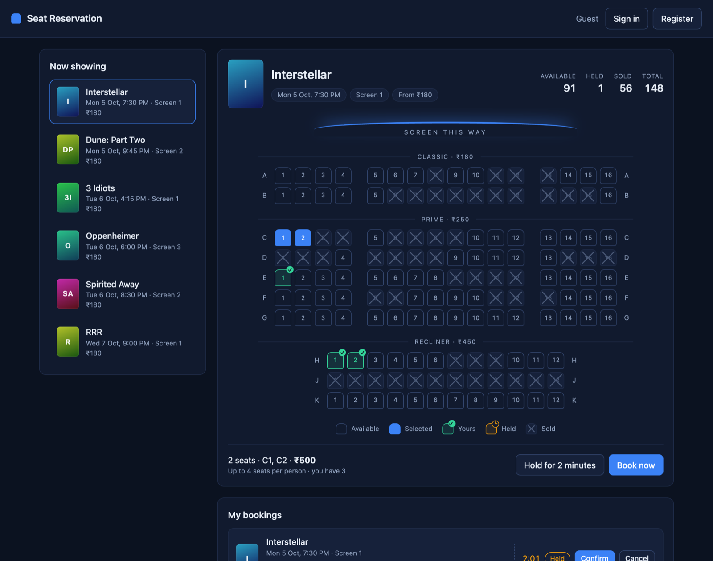
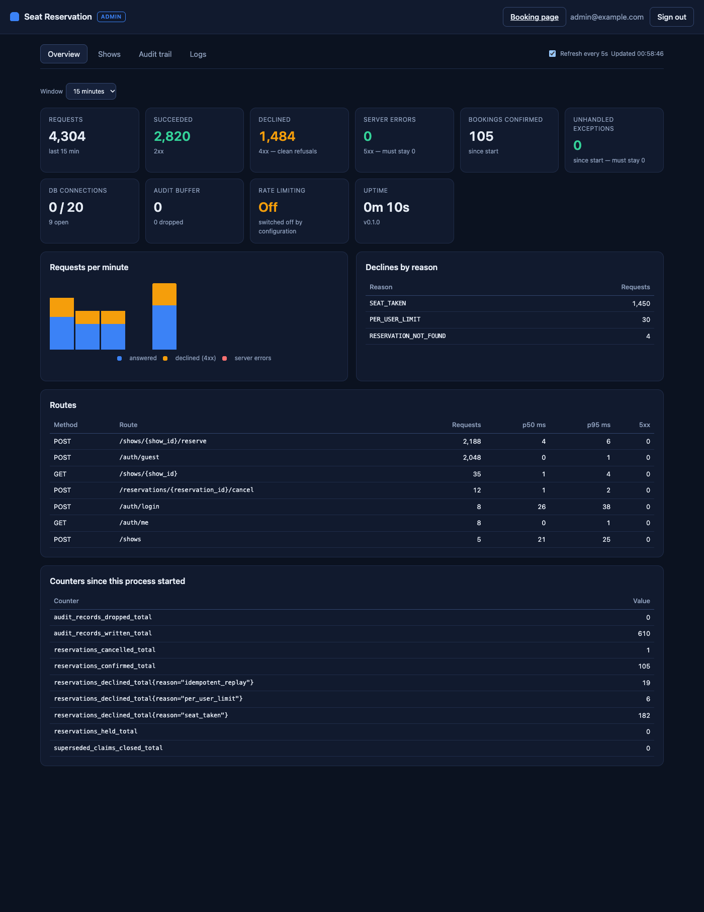

# Seat Reservation Service

Assigned-seat booking for ticketed events. One seat, one buyer, under any amount of
contention: N simultaneous requests for the same seat produce exactly one `201` and
N−1 clean `409`s — never a double-sell, never a `5xx`.

**Live:** <https://seat-reservation-vw5k.onrender.com> — the root is a web page: pick seats on a map, book or hold them, manage bookings ([/docs](https://seat-reservation-vw5k.onrender.com/docs) · [/readyz](https://seat-reservation-vw5k.onrender.com/readyz) · [/metrics](https://seat-reservation-vw5k.onrender.com/metrics)) · **How it works and why it is race-free:** [WRITEUP.md](WRITEUP.md)

FastAPI · asyncpg · PostgreSQL 16 · Alembic · Prometheus · Docker.

| | |
|---|---|
| Booking page | <https://seat-reservation-vw5k.onrender.com/> |
| **Admin console** — create shows, audit trail, live logs, system health | <https://seat-reservation-vw5k.onrender.com/admin> |
| Admin sign-in (fixed, for reviewers) | `admin@example.com` / `seat-admin-2026` |
| API docs | <https://seat-reservation-vw5k.onrender.com/docs> |
| Metrics | <https://seat-reservation-vw5k.onrender.com/metrics> |
| Design decisions | [WRITEUP.md](WRITEUP.md) |

**Read [Limitations](#limitations) before load-testing the live URL**: it is a free
instance with a fraction of a CPU.



## Run it

```bash
docker compose up --build        # Postgres + API; migrations run in the entrypoint
curl localhost:8080/readyz       # {"status":"ready",...}
```

Without Docker, against a local PostgreSQL 16:

```bash
python3.13 -m venv .venv && .venv/bin/pip install -e ".[dev]"
cp .env.example .env             # then set DATABASE_URL, JWT_SECRET, ADMIN_*
make migrate run                 # http://localhost:8000
make lint types test             # ruff, mypy --strict, pytest
```

## Give it a programme

```bash
ADMIN_EMAIL=… ADMIN_PASSWORD=… .venv/bin/python scripts/seed_demo.py https://seat-reservation-vw5k.onrender.com
```

Six films in a three-tier hall, each about a third sold through the real guest-and-reserve
path, so the page has something to show. Safe to run twice; for a local target the admin
credentials come from `./.env`.

## Burst it

```bash
# against the live service
ADMIN_EMAIL=admin@example.com ADMIN_PASSWORD=seat-admin-2026 \
  ./burst.sh https://seat-reservation-vw5k.onrender.com --concurrency 50

# against docker compose, at a size the free instance cannot serve
ADMIN_EMAIL=admin@example.com ADMIN_PASSWORD=seat-admin-2026 \
  ./burst.sh http://localhost:8080 --users 3000 --seats 1000 --hot 500 --concurrency 500
```

The burst creates its own show, so every number it checks is exact. It stampedes random
seats while sampling reconciliation mid-flight, releases a barrier-synchronised crowd
onto a single hot seat, fires one idempotency key twenty times at once, probes the
per-user limit with parallel requests, checks that a spoofed `user_id` is ignored and
that only the owner can cancel and the seat is then re-bookable, then reconciles the
API, the `201` bodies and `/metrics` against each other. It prints the outcome distribution by reason and
**exits non-zero on any invariant violation**.

The burst needs the admin sign-in because it creates its own show. Where rate
limiting is switched on, guest creation is limited per address; if the burst needs
more guests than the allowance holds it says so and waits as `Retry-After` instructs —
it has not hung.

## Quickstart

```bash
BASE=http://localhost:8080

# Admin (bootstrapped from ADMIN_EMAIL / ADMIN_PASSWORD) creates a show
ADMIN=$(curl -s $BASE/auth/login -H 'content-type: application/json' \
  -d '{"email":"admin@example.com","password":"seat-admin-2026"}' | jq -r .access_token)
SHOW=$(curl -s $BASE/shows -H "authorization: Bearer $ADMIN" -H 'content-type: application/json' \
  -d '{"name":"friday-night","seats":["A1","A2","A3"],"price_paise":25000}' | jq -r .show_id)

# A guest reserves — no sign-up needed
TOKEN=$(curl -s -X POST $BASE/auth/guest | jq -r .access_token)
curl -s $BASE/shows/$SHOW/reserve -H "authorization: Bearer $TOKEN" \
  -H 'content-type: application/json' -H 'Idempotency-Key: order-1' \
  -d '{"seats":["A1","A2"]}'                      # 201, status "confirmed"

curl -s $BASE/shows/$SHOW | jq .counts            # available + held + confirmed == total
curl -s $BASE/metrics | grep -E 'reservations_|seats_available'
```

## API

| Method | Path | Who | |
|---|---|---|---|
| `POST` | `/auth/register` · `/auth/login` · `/auth/guest` | public | returns a bearer token |
| `POST` | `/auth/refresh` | public | a refresh token in, a new access token out |
| `POST` | `/auth/upgrade` | guest | same account gains an email and password; its bookings stay |
| `GET` | `/auth/me` | any principal | |
| `POST` | `/shows` | admin | show and all its seats, one transaction; `seat_overrides` for per-seat price |
| `GET` | `/shows` | public | paginated catalogue, newest first |
| `GET` | `/shows/{id}` | public | seat map and counts from one snapshot |
| `POST` | `/shows/{id}/reserve` | any principal | **the atomic claim**; `Idempotency-Key` required |
| `POST` | `/reservations/{id}/cancel` | owner | releases the seats of a booking or a live hold; they are re-bookable at once |
| `POST` | `/reservations/{id}/confirm` | owner | turns a hold into a booking |
| `GET` | `/reservations` · `/reservations/{id}` | owner | own reservations only, paginated |
| `GET` | `/healthz` · `/readyz` · `/metrics` | public | liveness · real DB query · Prometheus |
| `GET` | `/admin/overview` · `/admin/audit` · `/admin/logs` · `/admin/shows` | admin | what the admin console reads |
| `GET` | `/admin` | public page | the admin console; everything it shows needs an admin token |
| `GET` | `/` · `/static/*` | public | the web page: three static files, no build step ([mds/18-frontend.md](mds/18-frontend.md)) |

Interactive docs at `/docs`.

## Semantics worth knowing

- **A reserve confirms immediately.** Pass `hold_ttl_seconds` to hold instead; a hold
  must be confirmed before it lapses, and a lapsed hold's seats are claimable at once.
- **All-or-nothing.** If any requested seat is taken, nothing is claimed; the `409`
  lists the conflicting labels.
- **Idempotency.** Same key + same request → the original reservation, replayed as
  `200` with `Idempotent-Replay: true` (never a second `201`). Same key + different
  request, or a different show → `409 IDEMPOTENCY_KEY_REUSED`. A *declined* request
  releases its key, so retrying it is a real new attempt.
- **Per-user limit** is exact under concurrency: ten parallel requests against a limit
  of four end with four.
- **Identity is the token's subject.** No request body has an identity field; a
  `user_id` in a payload is ignored.
- **Ownership failures are `404`**, not `403`, so reservation ids cannot be enumerated.
- **Cancel.** The owner can cancel a confirmed booking or a live hold; the seats go
  back to available and anyone can book them. Anyone else gets `404`. A repeat cancel
  is a `200` and never takes a seat back from its new owner. A hold that already
  lapsed answers `409 RESERVATION_EXPIRED`.
- **Sessions.** A token is valid for `ACCESS_TOKEN_TTL_SECONDS` — **one hour on the
  live service**, 15 minutes by default — after which requests answer
  `401 UNAUTHENTICATED`. `/auth/refresh` exchanges the refresh token from register or
  login for a new access token. Guests get a one-hour token and no refresh token:
  a guest session ends, by design.
- **Lists** are keyset-paginated: pass the `next_cursor` from one page as `cursor` for
  the next; `null` means there are no more.
- **Rate limits** are per signed-in user, so a crowd behind one address is never
  throttled as one. Only sign-in and guest creation are limited per address. A `429`
  carries `Retry-After`; ceilings are the `RATE_LIMIT_*` variables, and
  `RATE_LIMIT_ENABLED=false` switches limiting off (reported on `/readyz`).
- **Errors** share one envelope: `{"error": {"code", "message", "details", "request_id"}}`.
  Every response carries `X-Request-ID`, and every row written is stamped with it.

## Layout

```
app/api/routes      HTTP only: parse, delegate, serialize
app/services        orchestration and transaction boundaries
app/repositories    all SQL — seat_repo.py is the claim
app/db              pool, session guards, migrations, the effective-status expressions
app/core            config, errors, logging, security, metrics
app/static          the booking page and the admin console, served as they are
tests/concurrency   one race test per invariant, against real Postgres
burst/              the load script
mds/                the design, kept in step with the code — start at mds/00-overview.md;
                    mds/17-future-scope.md is everything not built
```

## Admin console

<https://seat-reservation-vw5k.onrender.com/admin> — sign in with
`admin@example.com` / `seat-admin-2026`.



| Tab | Shows |
|---|---|
| **Overview** | Requests, successes, declines and server errors over a chosen window; requests per minute; declines by reason; latency (p50/p95) per route; database connections in use; the audit buffer; every counter |
| **Shows** | Create a show; recent shows with seats available |
| **Audit trail** | One row per request: time, route, status, duration, outcome, who, which seats, request id. Filter by status, outcome, request id or show. Click a request id to see its log lines |
| **Logs** | The service's structured log lines, newest first, filterable by level, event and request id |

The admin sign-in is published here on purpose, so a reviewer can create shows and
watch a burst without asking. The account's password is reset to the configured one
every time the service starts. **Anyone can therefore act as admin on this demo**:
they can create shows and read the audit trail and logs. They cannot read a password
or a token — those are redacted before a line is stored — and there is no endpoint
that deletes or edits anything.

The log view is this process's most recent 2,000 lines, held in memory: it empties
when the service restarts, which on the free tier includes every wake from sleep. The
audit trail is in the database and survives restarts.

## Limitations

Stated plainly, because several of them will show up in a load test.

**The live instance is a free tier, and cannot be scaled from here.**

- It has a fraction of one CPU. Measured on it: about **19 bookings a second**, with
  half of requests answered within 2.2s and 95% within 7.1s at 50 in flight.
- A burst of 20,000 concurrent reservations would take it roughly 17 minutes. Long
  before that, clients and the platform's own proxy will time requests out — and a
  timeout or a `502` from the platform is not something this service can prevent.
- It sleeps after ~15 minutes idle. The first request then takes up to a minute.
- The free database is 1 GB and expires after the platform's free period.

**To test at the scale the brief describes, run it on your own machine or server:**

```bash
docker compose up --build
ADMIN_EMAIL=admin@example.com ADMIN_PASSWORD=seat-admin-2026 \
  ./burst.sh http://localhost:8080 --users 20000 --seats 4000 --hot 500 --concurrency 5000
```

On a laptop, one process, that run completes in about 95 seconds: 20,530 reserves,
one winner of 500 on the hot seat, no seat sold twice, the invariant held on every
sample, and **no 5xx from the service** (one request in 20,530 was dropped by the
client's own connection). The same image is what the live service runs.

**How the live service is configured** (what differs from the defaults in
`.env.example`):

| Setting | Live value | Why |
|---|---|---|
| `RATE_LIMIT_ENABLED` | `false` | The brief asks for one `201` and `409` for everyone else. A limiter would turn a load test from one machine into `429`s. The limiter is built and tested; it is switched off here, and `/readyz` reports that |
| `ACCESS_TOKEN_TTL_SECONDS` | `3600` | So a token minted at the start of a long test is still valid at the end. After an hour, requests answer `401` |
| `GUEST_TOKEN_TTL_SECONDS` | `3600` (default) | Guests cannot refresh; an hour is the whole session |
| `REFRESH_TOKEN_TTL_SECONDS` | `604800` (default) | Seven days, for registered users |
| `DB_POOL_MAX` | `20` | Sized to the database's connection ceiling, not to request volume; excess requests wait |
| `RATE_LIMIT_TRUSTED_PROXY_HOPS` | `3` | Render puts three proxies in front; found by test. Only matters when limiting is on |

**Known weaknesses**

- **The per-user seat limit is per account, and accounts are free.** Guests cost
  nothing to create and there is no payment step, so one person can make several
  accounts and book more than four seats. With rate limiting on, guest creation is
  held to one a second per address, which narrows this; on the live demo it is off.
  Closing it needs a payment or identity step the brief does not include.
- **Registering and signing in are slow under load.** Password hashing is
  deliberately expensive; sixty sign-ins at once overwhelm the free instance. Use
  guest tokens for load — `POST /auth/guest` is cheap.
- **Counters reset when the process restarts.** `/metrics` counters are in memory.
  The audit trail and the API's own counts are the durable record.
- **One process.** Rate-limit buckets and the log view are per process.
- **A crash is logged twice**, the second time without its request id.
- **Tests have only run on the development machine.** GitHub Actions is not enabled.

What is designed and not built is in [mds/17-future-scope.md](mds/17-future-scope.md).

## Deploy

[render.yaml](render.yaml) declares the web service and its PostgreSQL 16 database. Set
`ADMIN_EMAIL` and `ADMIN_PASSWORD` in the dashboard; everything else is declared. The
container entrypoint runs the database migrations before it starts the server.

On any other host: build the `Dockerfile`, give the container `DATABASE_URL`,
`JWT_SECRET` (32+ characters), `ADMIN_EMAIL`, `ADMIN_PASSWORD` (12+ characters),
`ALLOWED_EVENT_KINDS`, `DEFAULT_EVENT_KIND` and `DEFAULT_CURRENCY`, and point it at a
PostgreSQL 16 database. `docker-compose.yml` is a complete working example.
